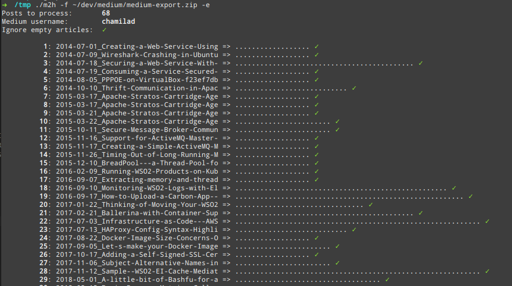

# Medium to Hugo Converter
> This is a modified fork of [bgadrian/medium-to-hugo](https://github.com/bgadrian/medium-to-hugo).
Reads a given Medium export archive, and converts the contents of the `posts` directory into Hugo compatible Markdown files.



## Features
### Upstream features
The features preserved from the upstream are,
* transform HTML posts to markdown
* SEO friendly (keeps the old URL as an **alias**)
* keeps all the metadata and adds most Hugo front Matter, including the alias with the old URL
* even if one article fails it keeps going
* marks the **drafts** as "draft_"
* Fetch the article **TAGS** (which are not included in the Medium exporter), compatible with Hugo Related feature
* Fetch all the **Images** 
* stories are ordered by date (`year-month-day_slug`)
* custom `.Params`: image, images, slug, subtitle
* minimal HTML cleanup (removed empty URLs, duplicate title and so on)
* adds `#layout...` suffix to every image so they can be styles accordingly from plain CSS with exactly same style as on Medium.

### Fork specific features
Following are the fork specific features. Most of these are personal preferences that might not suite all.
* Converts and writes all Markdown in the same directory, unlike the upstream project which creates a directory for each post
* Downloads images into one directory instead of a directory inside the post-specific directories
* Does not ignore comments
* Will ignore empty articles based on a flag (`-e`)
* Any self-references (links that point to articles by the same author) are fixed so that after conversion they point to the converted site


## Usage

1. Download your [medium data](https://help.medium.com/hc/en-us/articles/115004745787-Download-your-information)
2. Download [the latest `m2h` binary](https://github.com/chamilad/medium-to-hugo/releases), to a suitable place
3. Run `m2h` binary providing the path to the Medium extract. Provide flag `-e` if empty articles should be ignored.
4. `m2h` will create a directory in the current working directory named `medium-to-hugo_<date>_<time>_`. The converted files will be in the `out` directory inside.

```bash
# convert all posts from this medium extract
./m2h -f medium-export.zip

# convert all but empty posts
./m2h -f medium-export.zip -e
```

##### Output structure


##### Ignoring empty articles


##### Final output
 

### Build / Contribute
You need Bash, Go 1.11+

See Issues for a list of TODOs.

Untested in Windows and Mac
