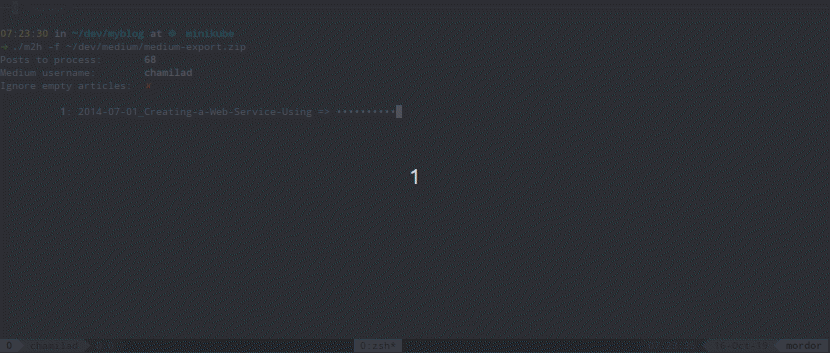
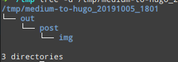
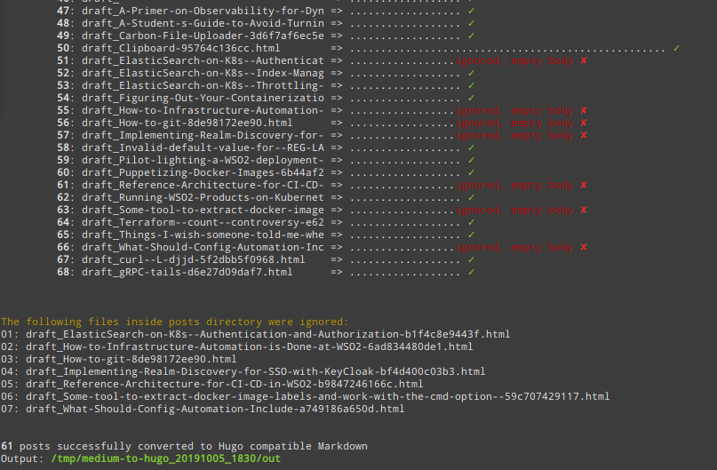
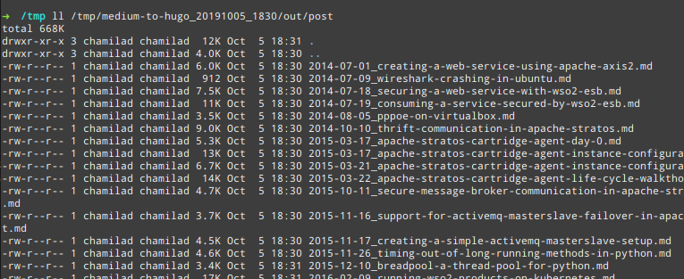

# Medium to Hugo Converter
> This is a modified fork of [bgadrian/medium-to-hugo](https://github.com/bgadrian/medium-to-hugo).

Reads a given Medium export archive, and converts the HTML contents of the `posts` directory into Hugo compatible Markdown files.

1. [Features](#features)
    1. [Upstream Features](#upstream-features)
    2. [Fork Specific Features](#fork-specific-features) 
2. [Usage](#usage)
3. [Building](#building)
4. [Contributing](#contributing)



## Features
Most of the functionality from upstream are preserved, however the underlying details are somewhat different.

### Upstream features
The features preserved from the upstream are,
* SEO friendly (keeps the old URL as an **alias**)
* Populates Hugo FrontMatter with relevant details
* Converts drafts and marks them specifically
* Fetch the article **TAGS** (which are not included in the Medium exporter), compatible with Hugo Related feature
* Fetch all the **Images** 
* Stories are ordered by date (`year-month-day_slug`)
* Custom `.Params`: image, images, slug, subtitle
* Minimal HTML cleanup (removed empty URLs, duplicate title and so on)
* Adds `#layout...` suffix to every image so they can be styles accordingly from plain CSS with exactly same style as on Medium.

### Fork specific features
Following are the fork specific features. 

* Converts and writes all Markdown in the same directory, unlike the upstream project which creates a directory for each post
* Downloads images into one directory instead of a directory inside the post-specific directories
* Does not ignore comments
* Will ignore empty articles based on a flag (`-e`)
* Any self-references (links that point to articles by the same author) are fixed so that after conversion they point to the converted site
* Read and convert Github Gist embeds into Markdown code blocks with relevant syntax highlighting
* Convert preformatted code blocks correctly by parsing embedded line break tags
* Corrects Medium export glitch where an empty line within a preformatted block generates two preformatted blocks
* Convert Slideshare Medium embeds to HTML embeds within Markdown.

> Hugo shortcodes are not used as a way to embed external resources like Gists to keep the Markdown generation reusable across different static site generators.


## Usage

1. Download your [medium data](https://help.medium.com/hc/en-us/articles/115004745787-Download-your-information)
2. Download [the latest `m2h` binary](https://github.com/chamilad/medium-to-hugo/releases), to a suitable place
3. Run `m2h` binary providing the path to the Medium extract. Provide flag `-e` if empty articles should be ignored.
4. `m2h` will create a directory in the current working directory named `medium-to-hugo_<date>_<time>_`. The converted files will be in the `out` directory inside.

```bash
# convert all posts from this medium extract
./m2h -f medium-export.zip

# convert all but empty posts
./m2h -f medium-export.zip -e
```

##### Output structure


##### Ignoring empty articles


##### Final output
 

## Building
You need Bash, Go 1.11+
1. Clone this repository, and checkout a specific commit if wanted to. 
2. Use the `Makefile` to build. If at version 2.0 tag or later, use `make release` to cross compile binaries for `linux`, `windows`, and `darwin`. For previous versions use `make buildall`.
 

## Contributing
Submit issues, PRs using Github. Please use the [upstream project](https://github.com/bgadrian/medium-to-hugo) if your requirements seem to match it. This fork has changed with my personal opinions. If you think your improvement matches the upstream project more than this, please contribute there. 


> Untested in Windows and Mac

## Similar Projects
1. [bgadrian/medium-to-hugo](https://github.com/bgadrian/medium-to-hugo) - The upstream project
2. [gautamdhameja/medium-2-md](https://github.com/gautamdhameja/medium-2-md) 
3. [The first Gist](https://gist.github.com/clipperhouse/010d4666892807afee16ba7711b41401) - The Gist that was used as the inspiration by the upstream project

